Select your language. 

1. Make yourself familiar with the instruments by hovering over them, then click on the Start button to start the experiment. 
2. Turn on the main switch. 
3. Press the power button on the conductometer. 
4. Rotate the FUNCTION knob and set it to CELL-CONST mode. 
5. Rotate the CELL-CONST knob to set the cell constant. 
6. Rotate the FUNCTION knob and set it back to MHOS mode. 
7. Clean the conductivity cell with distilled water. 
8. Note down every value shown on the conductivity meter screen. 
9. Measure NaCl solution conductivity at different concentrations: 0.05 N, 0.025 N, 0.0125 N, 0.0062 N, 0.0031 N, 0.0016 N. 
10. Dip the conductivity cell into each sodium chloride solution of different concentrations one by one. 
11. Leave the conductivity cell dipped in the solution for some time to establish equilibrium for accurate measurement. 
12. Note down every reading shown on the conductometer screen. 
13. Measure HCl solution conductivity at different concentrations: 0.05 N, 0.025 N, 0.0125 N, 0.0062 N, 0.0031 N, 0.0016 N. 
14. Note down the readings carefully. 
15. Clean the conductivity cell with distilled water. 
16. Write down readings for each hydrochloric acid solution. 
17. Leave the conductivity cell dipped in the solution for some time to establish equilibrium for accurate measurement. 
18. Note down every reading shown on the conductometer screen. 
19. Measure conductivity of CH3COONa solution at different concentrations: 0.05 N, 0.025 N, 0.0125 N, 0.0062 N, 0.0031 N, 0.0016 N. 
20. Note down the readings carefully. 
21. Clean the conductivity cell with distilled water. 
22. Write down readings for sodium acetate solution. 
23. Leave the conductivity cell dipped in the solution for some time to establish equilibrium for accurate measurement. 
24. Note down every reading shown on the conductometer screen. 
25. Press the Observations button to see all readings, values, and calculations. 

<!--<b> Materials & Reagents Required:</b> 
A.	Volumetric flask (100 mL) 
B.	Measuring cylinder (100 mL) 
C.	Burette (25 mL) 
D.	Conical flask (100 mL) 
E.	Beaker (250 mL) 
F.	Conductivity meter 
 
<b> Procedure in laboratory (diagram)</b> 
 
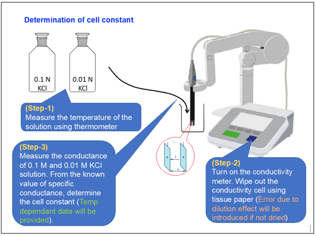   
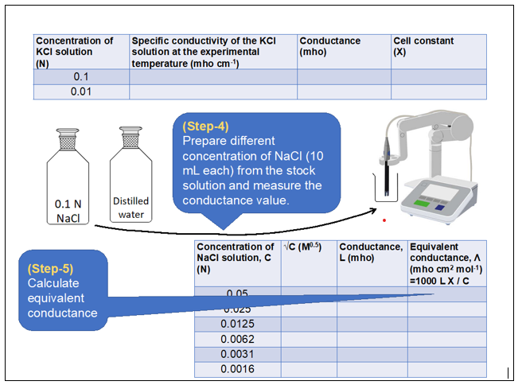 
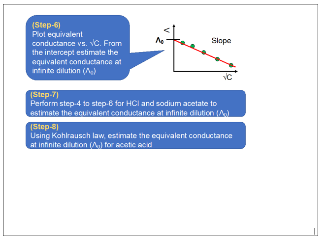  
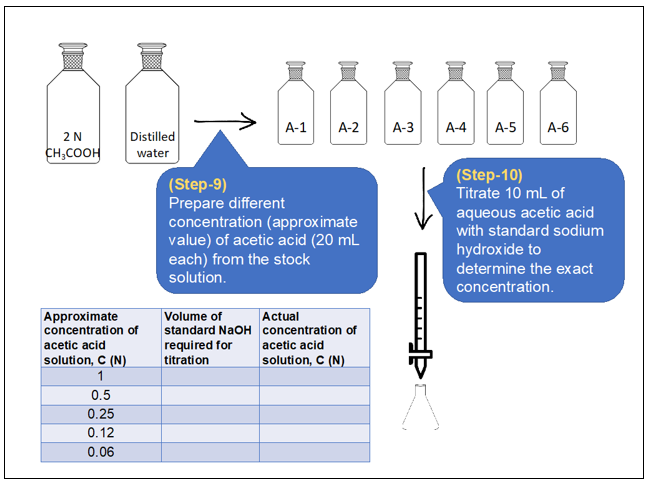
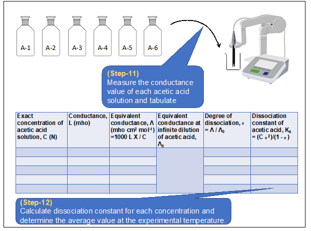  
<b> Procedure in laboratory</b>  
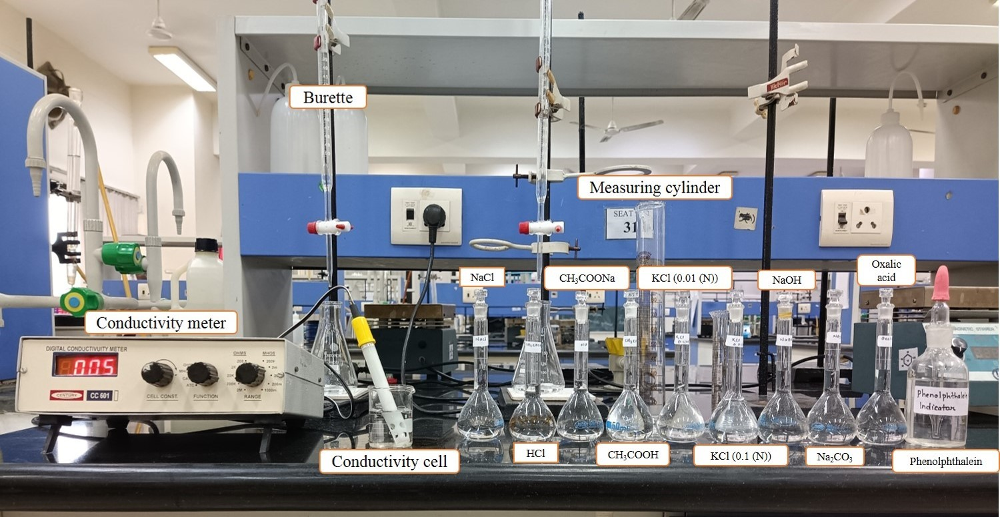  
<b> Sample Data and Analysis</b>  
The experimental temperature is 26 ⁰C.  
<b> Determination of cell constant</b>  
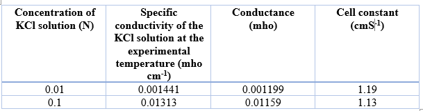 
Average cell constant = (1.19+1.13)/2 = 1.16 cm-1  
<b> Determination of equivalent conductance of NaCl at different concentrations</b>  
  
<b> Determination of equivalent conductance of HCl at different concentrations</b>  
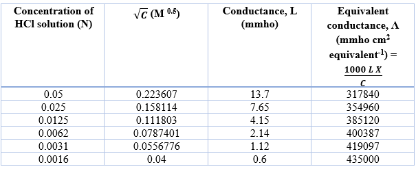  
<b> Determination of equivalent conductance of CH3COONa at different concentrations</b>  
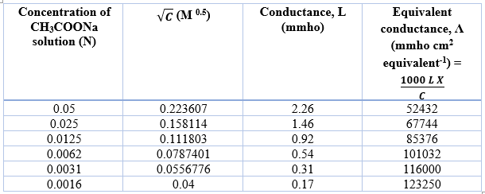  
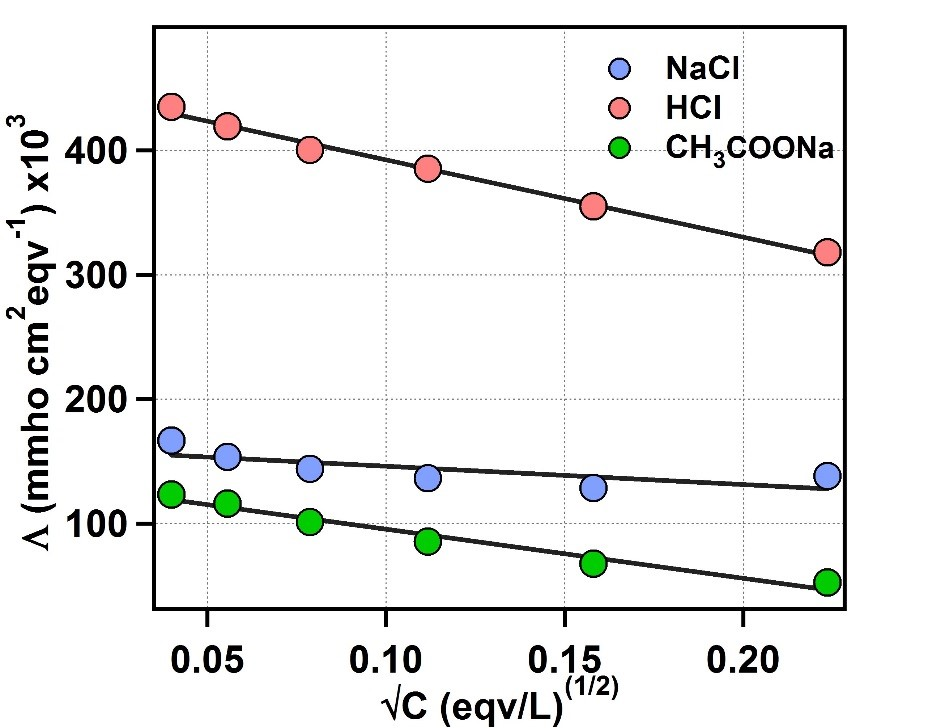 
Figure 1: Plot of equivalent conductance vs √C for NaCl, HCl and CH3COONa.  
The Y-axis intercept for NaCl, HCl and CH3COONa are 169960 mmho cm2 eqv-1, 454680 mmho cm2 eqv-1, 135130 mmho cm2 eqv-1, respectively.
The equivalent conductance of acetic acid at infinite dilution (Λ0) is given as, 
&#923;0 = &#923;0CH₃COONa + &#923;0HCl - &#923;0NaCl 
= (135130+454680-169960) mmho cm2 eqv-1 
= 419850 mmho cm2 eqv-1   
<b> Determination of exact concentration of acetic acid solutions</b>  
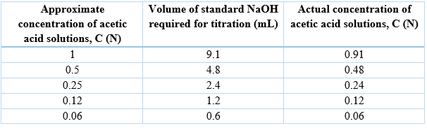  
<b> Determination of dissociation constant of acetic acid by conductance measurement</b> 
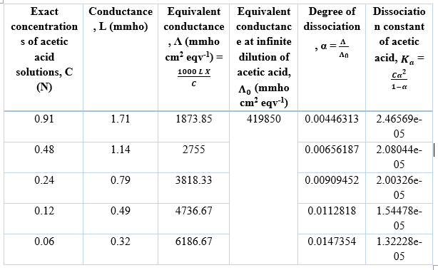  
<b> Procedure in simulator of the experiment</b>  
<b> Analysis</b>  
A.	Determine the cell constant of the conductivity cell.  
B.	Determine equivalent conductance at infinite dilution for NaCl, HCl and CH3COONa. 
C.	Determine the dissociation constant of acetic acid by conductivity measurement.

