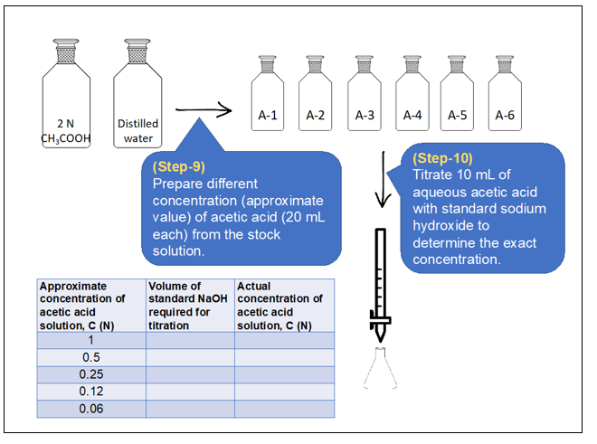
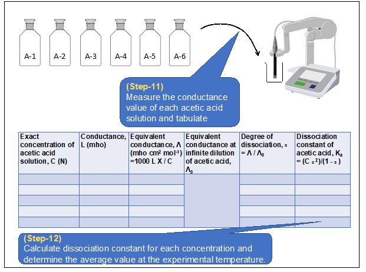
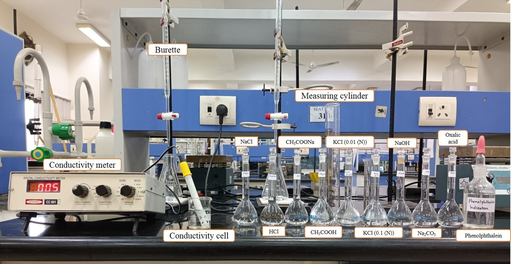
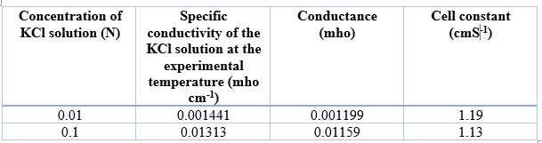
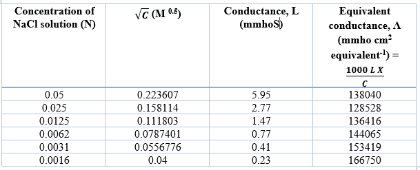
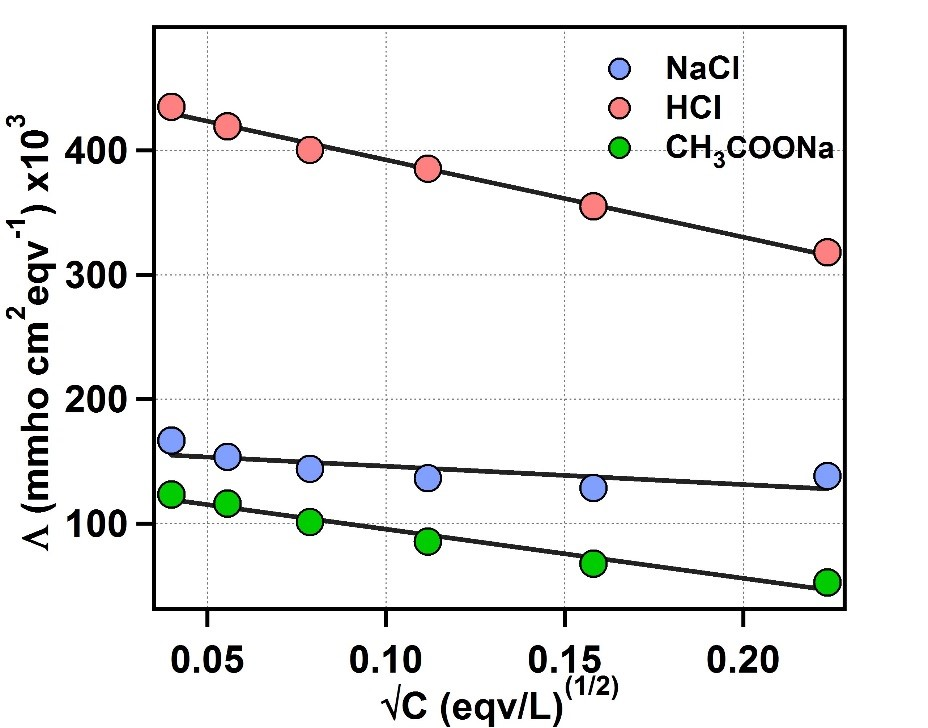
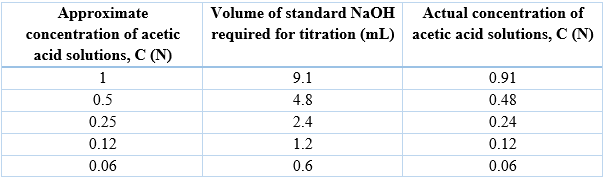
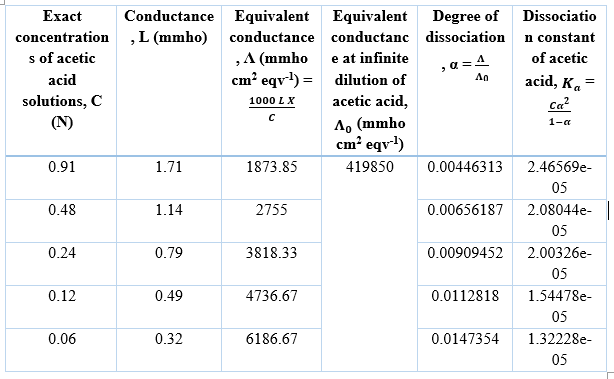

<b> Materials & Reagents Required:</b> 
A.	Volumetric flask (100 mL) 
B.	Measuring cylinder (100 mL) 
C.	Burette (25 mL) 
D.	Conical flask (100 mL) 
E.	Beaker (250 mL) 
F.	Conductivity meter 
 
<b> Procedure in laboratory (diagram)</b> 
 
   
 
  

  
<b> Procedure in laboratory</b>  
  
<b> Data and the analysis</b>  
The experimental temperature is 26 ⁰C.  
<b> Determination of cell constant</b>  
 
Average cell constant = (1.19+1.13)/2 = 1.16 cm-1  
<b> Determination of equivalent conductance of NaCl at different concentrations</b>  
  
<b> Determination of equivalent conductance of HCl at different concentrations</b>  
  
<b> Determination of equivalent conductance of CH3COONa at different concentrations</b>  
  
 
Figure 1: Plot of equivalent conductance vs √C for NaCl, HCl and CH3COONa.  
The Y-axis intercept for NaCl, HCl and CH3COONa are 169960 mmho cm2 eqv-1, 454680 mmho cm2 eqv-1, 135130 mmho cm2 eqv-1, respectively.
The equivalent conductance of acetic acid at infinite dilution (Λ0) is given as, 
Λ0 = Λ_0^CH3COONa+Λ_0^HCl-Λ_0^NaCl 
= (135130+454680-169960) mmho cm2 eqv-1 
= 419850 mmho cm2 eqv-1   
<b> Determination of exact concentration of acetic acid solutions</b>  
  
<b> Determination of dissociation constant of acetic acid by conductance measurement</b> 
  
<b> Procedure in simulator of the experiment</b>  
<b>7. Analysis</b>  
A.	Determine the cell constant of the conductivity cell.  
B.	Determine equivalent conductance at infinite dilution for NaCl, HCl and CH3COONa. 
C.	Determine the dissociation constant of acetic acid by conductivity measurement.

